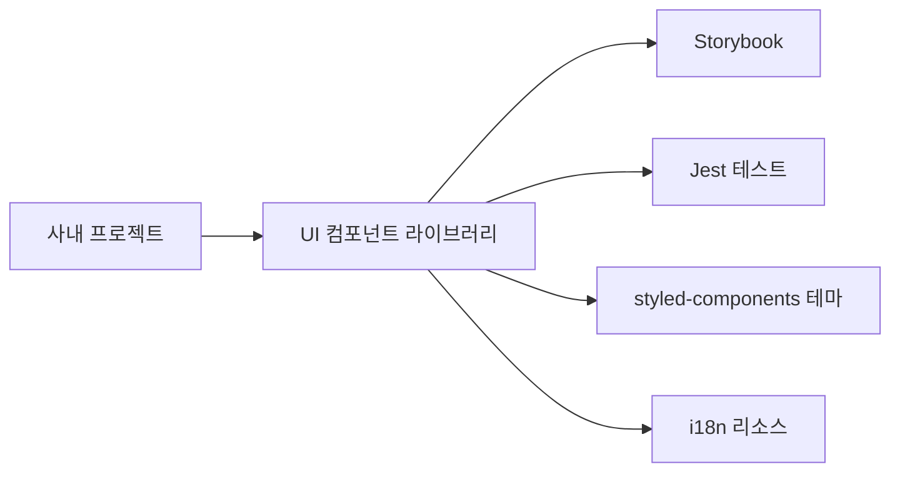

# Technical Requirements Document (TRD)

## 1. Executive Technical Summary
- **Project Overview**: React, Next.js, TypeScript 기반의 재사용 가능한 내부 UI 컴포넌트 라이브러리 구축. Storybook을 활용한 시각적 문서화 및 프리뷰 환경 제공. 다크 모드, i18n, 반응형 지원, Jest 기반 테스트를 통해 품질 확보. 로컬 링크 배포 방식으로 초기 제공.
- **Core Technology Stack**: React, Next.js, TypeScript, styled-components, Storybook, Jest를 핵심 기술 스택으로 사용.
- **Key Technical Objectives**: 4주 이내 MVP 배포, 사내 프로젝트 세팅 시간 30% 단축, 컴포넌트 중복 구현 50% 이상 감소.
- **Critical Technical Assumptions**: 소규모 팀으로 빠른 의사 결정 가능, 로컬 링크 배포 방식이 초기 단계에 적합, 디자이너 리소스 제한적.

## 2. Tech Stack

| Category          | Technology / Library        | Reasoning (Why it's chosen for this project) |
| ----------------- | --------------------------- | -------------------------------------------- |
| UI Framework      | React                       | 컴포넌트 기반 아키텍처, 높은 재사용성 및 생산성 |
| Server-Side Rendering | Next.js                    | 초기 로딩 속도 개선, SEO 최적화 (향후 확장 고려) |
| Language          | TypeScript                  | 정적 타입 검사, 코드 안정성 및 유지보수성 향상 |
| Styling           | styled-components           | 컴포넌트 레벨 스타일링, 테마 지원 용이성 |
| Documentation & Preview | Storybook                 | 컴포넌트 시각적 문서화, 프리뷰, 개발 환경 제공 |
| Testing           | Jest                        | 유닛 테스트, 컴포넌트 동작 검증 |
| Testing Library | @testing-library/react | React 컴포넌트 테스트를 위한 유틸리티 제공 |
| Linting | ESLint | 코드 스타일 일관성 유지 및 오류 방지 |
| Formatting | Prettier | 자동 코드 포맷팅으로 코드 가독성 향상 |
| Git Hooks | Husky | Git 커밋 전 Linting 및 테스트 실행 |

## 3. System Architecture Design

### Top-Level building blocks
*   **UI 컴포넌트 라이브러리**:
    *   재사용 가능한 UI 컴포넌트 (Button, Input, Modal, Layout 등)
    *   styled-components 기반 스타일링
    *   TypeScript 기반 타입 정의
*   **Storybook**:
    *   컴포넌트 문서화 및 프리뷰 환경 제공
    *   다크 모드, i18n, 반응형 뷰포트 컨트롤 지원
    *   Docs 애드온, Controls 애드온 활용
*   **테스팅 환경**:
    *   Jest 기반 유닛 테스트
    *   @testing-library/react 활용
    *   코드 커버리지 리포트 생성
*   **개발 환경**:
    *   ESLint, Prettier, Husky 설정
    *   로컬 링크 배포 방식

### Top-Level Component Interaction Diagram



*   **사내 프로젝트**: UI 컴포넌트 라이브러리를 import하여 사용.
*   **UI 컴포넌트 라이브러리**: Storybook을 통해 문서화 및 프리뷰 제공, Jest 테스트를 통해 품질 검증.
*   **styled-components 테마**: 다크 모드 등 테마 관련 스타일 제공.
*   **i18n 리소스**: 다국어 지원을 위한 JSON 파일 제공.

### Code Organization & Convention
**Domain-Driven Organization Strategy**
- **Domain Separation**: 컴포넌트 종류별로 디렉토리 분리 (e.g., `components/button`, `components/input`).
- **Layer-Based Architecture**: 각 컴포넌트 디렉토리 내에 스타일, 타입, 컴포넌트 파일을 분리 (e.g., `components/button/Button.tsx`, `components/button/Button.styles.ts`, `components/button/Button.types.ts`).
- **Feature-Based Modules**: 컴포넌트 관련 기능 (테스트, 스토리)을 컴포넌트 디렉토리 내에 포함 (e.g., `components/button/Button.test.tsx`, `components/button/Button.stories.tsx`).
- **Shared Components**: 공통 타입, 유틸리티 함수 등을 `shared` 디렉토리에 관리.

**Universal File & Folder Structure**
```
/
├── .eslintrc.js           # ESLint 설정
├── .prettierrc.js          # Prettier 설정
├── .husky/                # Husky 설정 디렉토리
│   └── pre-commit         # pre-commit 훅
├── src/                   # 소스 코드 디렉토리
│   ├── components/          # UI 컴포넌트 디렉토리
│   │   ├── button/           # Button 컴포넌트 디렉토리
│   │   │   ├── Button.tsx      # Button 컴포넌트
│   │   │   ├── Button.styles.ts # Button 스타일
│   │   │   ├── Button.types.ts  # Button 타입 정의
│   │   │   ├── Button.test.tsx   # Button 테스트
│   │   │   └── Button.stories.tsx# Button 스토리
│   │   ├── input/            # Input 컴포넌트 디렉토리
│   │   │   └── ...
│   │   ├── modal/            # Modal 컴포넌트 디렉토리
│   │   │   └── ...
│   │   └── layout/           # Layout 컴포넌트 디렉토리
│   │       └── ...
│   ├── styles/             # 전역 스타일 디렉토리
│   │   ├── theme.ts         # 테마 정의
│   │   └── global.ts        # 전역 스타일 정의
│   ├── i18n/                # 국제화 디렉토리
│   │   ├── en.json          # 영어 리소스
│   │   └── ko.json          # 한국어 리소스
│   ├── shared/              # 공유 컴포넌트 및 유틸리티
│   │   ├── types/           # 공통 타입 정의
│   │   └── utils/           # 유틸리티 함수
│   ├── App.tsx              # Next.js App 컴포넌트
│   └── index.ts             # 컴포넌트 export
├── .storybook/           # Storybook 설정 디렉토리
│   ├── main.js            # Storybook 메인 설정
│   └── preview.js         # Storybook 프리뷰 설정
├── jest.config.js         # Jest 설정
├── tsconfig.json          # TypeScript 설정
├── package.json           # 패키지 설정
└── README.md              # README 파일
```

### Data Flow & Communication Patterns
- **Client-Server Communication**: 해당 없음 (UI 컴포넌트 라이브러리이므로 서버 통신 로직은 포함하지 않음).
- **Database Interaction**: 해당 없음.
- **External Service Integration**: 해당 없음.
- **Real-time Communication**: 해당 없음.
- **Data Synchronization**: 해당 없음.

## 4. Performance & Optimization Strategy
*   컴포넌트 불필요한 리렌더링 방지 (`React.memo`, `useCallback`, `useMemo` 활용).
*   이미지 최적화 (Next.js `Image` 컴포넌트 활용).
*   코드 스플리팅 (Next.js 기본 지원).
*   styled-components CSS-in-JS 최적화 (Babel 플러그인 활용).

## 5. Implementation Roadmap & Milestones
### Phase 1: Foundation (MVP Implementation)
- **Core Infrastructure**: 리포지토리 설정, ESLint/Prettier 설정, Storybook 초기 설정.
- **Essential Features**: Button, IconButton, Input(Text, Number), Modal, Layout(Header, Footer) 컴포넌트 구현.
- **Basic Security**: 해당 없음 (UI 컴포넌트 라이브러리이므로 보안 관련 기능은 포함하지 않음).
- **Development Setup**: 로컬 링크 방식 배포 설정.
- **Timeline**: 1~2주차 완료.

### Phase 2: Feature Enhancement
- **Advanced Features**: 다크 모드 테마 시스템, i18n 설정, 반응형 뷰포트 애드온 설정.
- **Performance Optimization**: 컴포넌트 성능 최적화.
- **Enhanced Security**: 해당 없음.
- **Monitoring Implementation**: 해당 없음.
- **Timeline**: 3~4주차 완료.

## 6. Risk Assessment & Mitigation Strategies
### Technical Risk Analysis
- **Technology Risks**: styled-components의 런타임 오버헤드 발생 가능성.
    - **Mitigation Strategies**: styled-components Babel 플러그인 적용, 필요 시 CSS Modules로 전환 고려.
- **Performance Risks**: 컴포넌트 복잡도 증가에 따른 렌더링 성능 저하 가능성.
    - **Mitigation Strategies**: `React.memo`, `useCallback`, `useMemo` 활용, 불필요한 리렌더링 방지.
- **Security Risks**: 해당 없음.
- **Integration Risks**: 해당 없음.

### Project Delivery Risks
- **Timeline Risks**: 컴포넌트 개발 지연 가능성.
    - **Contingency Plans**: 우선순위가 낮은 컴포넌트 개발 연기, 외부 라이브러리 활용 검토.
- **Resource Risks**: 개발자 역량 부족으로 인한 문제 발생 가능성.
    - **Contingency Plans**: 팀 내 스터디 진행, 외부 전문가 컨설팅.
- **Quality Risks**: 테스트 부족으로 인한 버그 발생 가능성.
    - **Contingency Plans**: 테스트 코드 작성 강화, 코드 리뷰 활성화.
- **Deployment Risks**: 로컬 링크 방식 배포의 불편함.
    - **Contingency Plans**: GitHub Packages로 단계적 전환 고려.
